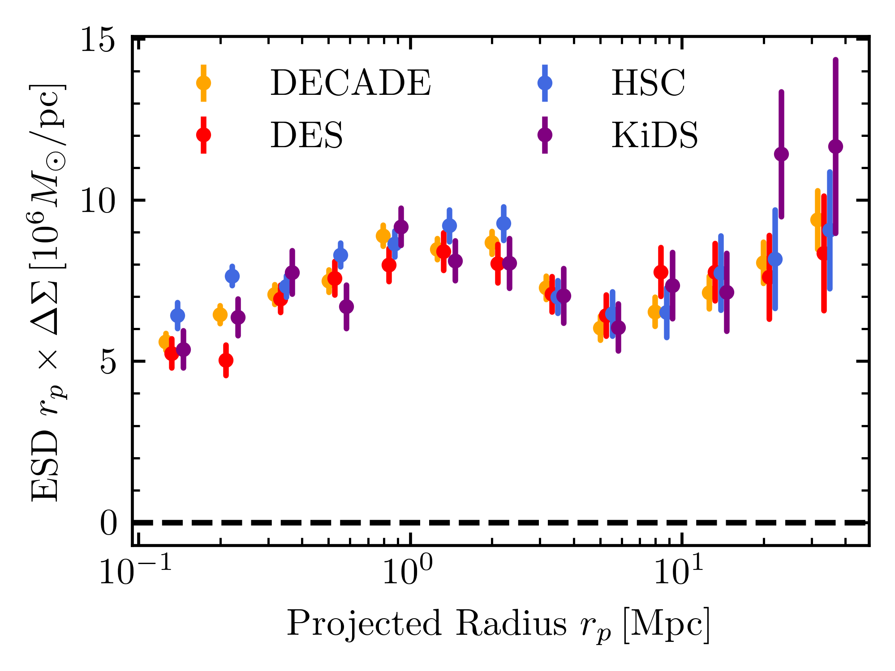

# dsigma: galaxy-galaxy lensing made easy

`dsigma` is an easy-to-use pipeline for analyzing galaxy-galaxy lensing. It is
written in pure python, has a broadly applicable API and is optimized for
computational efficiency. While originally intended to be used with the shape
catalog of the Hyper-Suprime Cam (HSC) survey, it should work for other
surveys like the Canada-France-Hawaii Telescope Lensing Survey (CFHTLenS) or
the Kilo-Degree Survey (KiDS).

### Authors

* Johannes Lange
* Song Huang

### Documentation

A documentation for `dsigma` with concept introductions, examples and API
documentation can be found at dsigma.readthedocs.io.

### License

`dsigma` is licensed under the MIT License.
