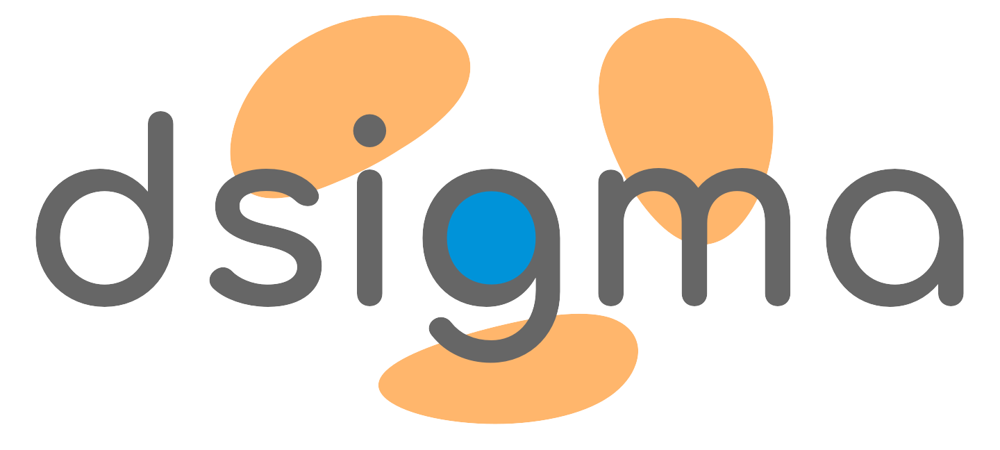
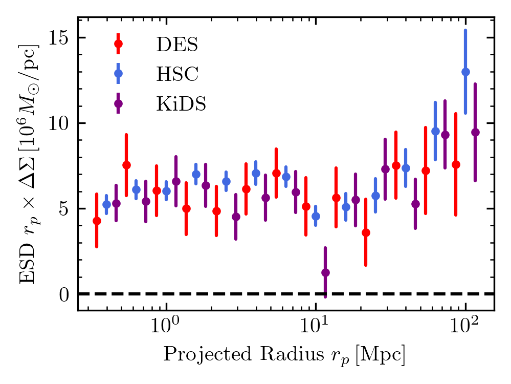

Overview
========

:code:`dsigma` is an easy-to-use python package for measuring gravitational galaxy-galaxy lensing. Using a lensing catalog, it estimates excess surface density around a population of lenses, such as galaxies in the Sloan Digital Sky Survey or the Baryon Oscillation Spectroscopic Survey. It has a broadly applicable API and can utilize data from the Dark Energy Survey (DES), the Kilo-Degree Survey (KiDS), and the Hyper-Suprime Cam (HSC) lensing surveys, among others. With core computations written in C, :code:`dsigma` is very fast. Additionally, :code:`dsigma` provides out-of-the-box support for estimating covariances with jackknife resampling and calculating various summary statistics. Below is a plot showing the excess surface density around galaxies in the CMASS sample calculated with :code:`dsigma`.

.. toctree::
    :hidden:
    :caption: Getting Started
    :maxdepth: 1

    installation
    background

.. toctree::
    :hidden:
    :caption: Workflow
    :maxdepth: 1

    preparation
    precomputation
    stacking
    resampling
    magnification

.. toctree::
    :caption: Applications
    :maxdepth: 1
    :hidden:

    application_intro
    application_des
    application_hsc
    application_kids

.. toctree::
    :caption: API Documentation
    :maxdepth: 1
    :hidden:

    api/helpers
    api/jackknife
    api/physics
    api/precompute
    api/stacking
    api/surveys

Authors
-------

* Johannes Lange
* Song Huang

Attribution
-----------

:code:`dsigma` is listed in the `Astronomy Source Code Library <https://ascl.net/2204.006>`_. If you find the code useful in your research, please cite `Lange & Huang (2022) <https://ui.adsabs.harvard.edu/abs/2022ascl.soft04006L/abstract>`_.

License
-------

:code:`dsigma` is licensed under the MIT License.
