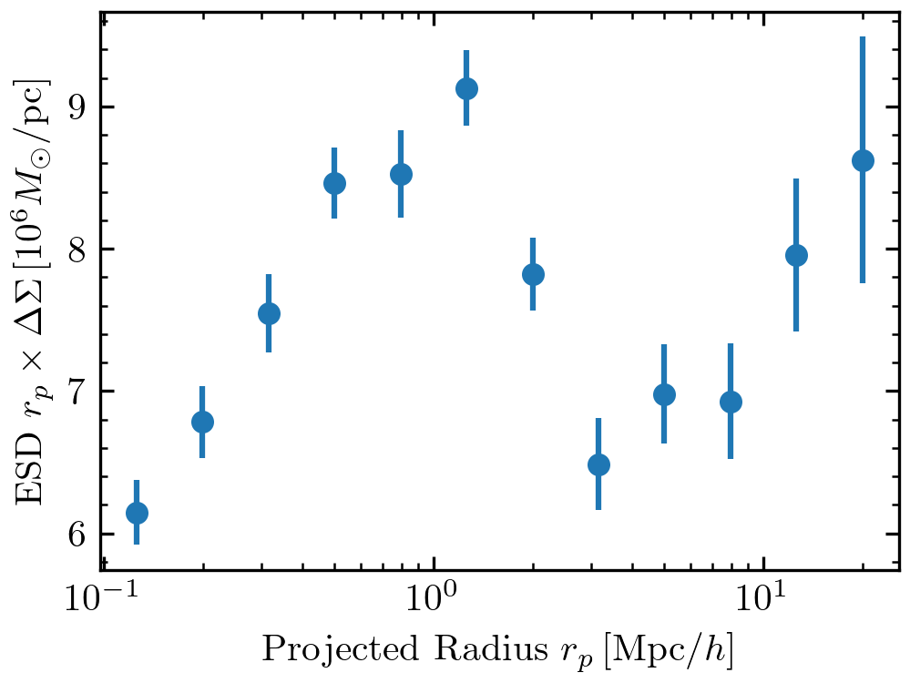

Quickstart
==========

In this quick example, we will calculate the lensing amplitude around galaxies in `BOSS <https://data.sdss.org/sas/dr12/boss/lss/>`_ in the redshift range :math:`0.2 < z_l < 0.4`. Let's use the publicly available DECADE catalog for this task (see :doc:`../applications/decade`).

.. code-block:: python

    import matplotlib.pyplot as plt
    import numpy as np
    from astropy.table import Table

    from dsigma.jackknife import compute_jackknife_fields, jackknife_resampling
    from dsigma.precompute import precompute
    from dsigma.stacking import excess_surface_density

    # Import lenses and cut to redshift range.
    table_l = Table.read('galaxy_DR12v5_CMASSLOWZTOT_North.fits.gz')
    for key in ['Z', 'RA', 'DEC']:
        table_l.rename_column(key, key.lower())
    table_l['w_sys'] = 1
    table_l = table_l[(0.2 < table_l['z']) & (table_l['z'] < 0.4)]

    # Load source galaxies and their redshift calibration.
    table_s = Table.read('decade_ngc.hdf5', path='catalog')
    table_n = Table.read('decade_ngc.hdf5', path='calibration')

    # Run the expensive precomputation.
    rp_bins = np.logspace(-1, 1.4, 13)
    precompute(table_l, table_s, rp_bins, table_n=table_n, progress_bar=True)

    # Calculate the signal.
    kwargs = dict(scalar_shear_response_correction=True,
                  matrix_shear_response_correction=True)
    results = excess_surface_density(table_l, return_table=True, n_jobs=8, **kwargs)

    # Calculate errors using jackknife resampling.
    compute_jackknife_fields(table_l, 100)
    results['ds_err'] = np.sqrt(np.diag(jackknife_resampling(
        excess_surface_density, table_l, **kwargs)))

    # Plot the results.
    rp = np.sqrt(results['rp_min'] * results['rp_max'])
    plt.errorbar(rp, rp * results['ds'], yerr=rp * results['ds_err'], fmt='o',
                 ms=5)
    plt.xscale('log')
    plt.xlabel(r'Projected Radius $r_p \, [\mathrm{Mpc} / h]$')
    plt.ylabel(r'ESD $r_p \times \Delta \Sigma \, [10^6 M_\odot / \mathrm{pc}]$')

For more details, refer to the workflow and application pages.
