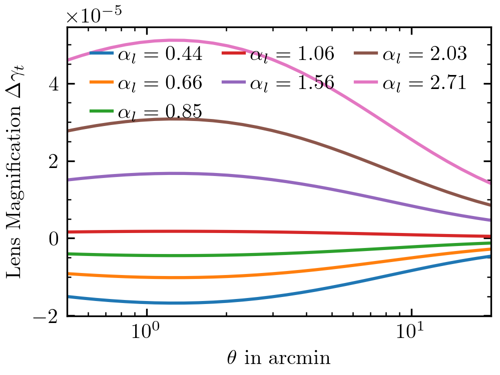

Lens Magnification
==================

Galaxy-galaxy lensing measures the mean tangential shear of source galaxies at redshift :math:`z_{\rm s}` induced by lens galaxies at redshift :math:`z_{\rm l} < z_{\rm s}`. However, in principle, all foreground structures at :math:`z_{\rm f} < z_{\rm l}` will contribute to the shear distortion of source galaxies. To first order, foreground structures are uncorrelated with the lens plane such that the expected tangential shear around lenses coming from foreground structures is zero, on average.

However, the magnification of lens galaxies by foreground structures at :math:`z_{\rm f} < z_{\rm l}` will induce spatial correlations such that the tangential shear induced by foreground structures is expected to be non-zero. This effect is called lens magnification and can be an important contributor to the mean tangential shear around lens galaxies. The strength of this effect depends on the response of lenses to magnification, i.e., how much more likely a galaxy is to make it into the lens sample if it is gravitationally lensed. This is quantified by the parameter :math:`\alpha`. We refer the reader to `Unruh et al. (2020) <https://doi.org/10.1051/0004-6361/201936915>`_ for a detailed investigation of this effect.

``dsigma`` implements the estimate for lens magnification described in this publication. For example, the code below reproduces the pink line in Fig. 5 of Unruh et al. (2020). To estimate the power spectrum, it relies on `CAMB <https://camb.readthedocs.io>`_.

.. code-block:: python

    import matplotlib.pyplot as plt
    import numpy as np

    from astropy import units as u
    from dsigma.physics import lens_magnification_shear_bias
    from astropy.cosmology import FlatLambdaCDM

    z_l = 0.41
    z_s = 0.99

    # Millennium simulation cosmology
    cosmology = FlatLambdaCDM(Ob0=0.045, Om0=0.25, H0=73, Tcmb0=2.7)
    sigma_8 = 0.9
    n_s = 1.0

    theta = np.geomspace(0.5, 20, 30) * u.arcmin

    for alpha_l in [0.44, 0.66, 0.85, 1.06, 1.56, 2.03, 2.71]:
        gt = lens_magnification_shear_bias(
            theta, alpha_l, z_l, z_s, cosmology=cosmology, sigma_8=sigma_8,
            n_s=n_s)
        plt.plot(theta, gt, label=rf"$\alpha_l = {alpha_l:.2f}$")
    
    plt.legend(loc='upper center', frameon=False, ncols=3, handletextpad=0.3,
               columnspacing=1, handlelength=1)
    plt.xscale('log')
    plt.xlabel(r'$\theta$ in arcmin')
    plt.ylabel(r'Lens Magnification $\Delta \gamma_t$')
    plt.xlim(0.5, 20)

In the same way, we can use :func:`~dsigma.stacking.lens_magnification_bias` to estimate the lens magnification bias. In this case, to calculate the additive shear bias, ``dsigma`` uses the mean lens and source redshift. Furthermore, to convert this into an estimate of the bias in :math:`\Delta\Sigma`, it multiplies this with the mean critical surface density. Note that the lens magnification bias is purely additive, i.e., it can be corrected for by subtracting the bias estimate from the total lensing signal. Typically, lens magnification should be applied for lenses at :math:`z_l \gtrsim 0.4`.
